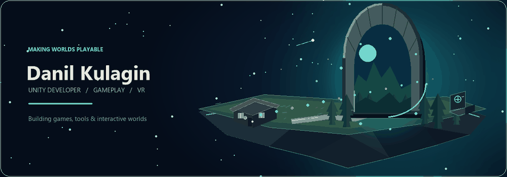

<div align="center">



### Unity developer · Gameplay systems · VR · WebGL

I turn ideas into playable things: game mechanics, interactive training, and tools that make development smoother.

[](https://unity.com/)
[](https://learn.microsoft.com/dotnet/csharp/)
[](https://store.steampowered.com/steamvr)
[](https://developer.mozilla.org/docs/Web/API/WebGL_API)

</div>

## Explore the 3D scene

A tiny floating world built from low-poly geometry. **Drag to rotate** the scene and use the **scroll wheel to zoom**.

Open [`floating-island.stl`](./floating-island.stl) in GitHub's 3D viewer to rotate and zoom the scene.

---

## What I build

- **Gameplay** — prototypes and mechanics that feel good to play.
- **VR experiences** — interactive training built around SteamVR.
- **Unity tools** — practical systems for localization and iteration.
- **WebGL experiments** — bringing playable ideas to the browser.

## Selected projects

| Project | What it is | Built with |
| --- | --- | --- |
| [Fire Safety Trainer](https://github.com/JILYK/SteamVR_FireSafetyTrainer) | A VR fire-safety training experience. | Unity · C# · SteamVR |
| [Text Translation System for Unity](https://github.com/JILYK/Text-Translation-System-for-Unity) | Translation and localization tooling for Unity projects. | Unity · C# |
| [Zombies Attack](https://github.com/JILYK/Zombies-Attack) | A game prototype exploring Unity gameplay. | Unity · C# |
| [TestWebGL](https://github.com/JILYK/TestWebGL) | A sandbox for browser-ready WebGL builds. | WebGL · HTML |

## How I work

```text
Prototype → Playtest → Polish → Ship
```

I enjoy the whole loop: shaping a mechanic, building the systems behind it, and getting a playable version into people's hands.

## Find me

[GitHub · @JILYK](https://github.com/JILYK)

<div align="center">

<sub>Made with Unity, C#, and a little too much curiosity.</sub>

</div>


